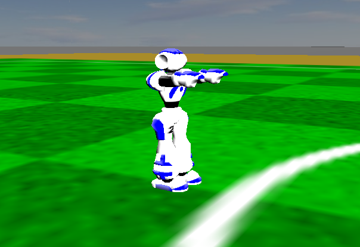

.. _launching_a_player:

Launching a player
##################

.. warning::

  This tutorial assumes you have done the following:

  * `SimSpark Installation`_,
  * `ROS2 Nao Package Installation`_,
  * Installed this package
  
  If you haven't installed any of the above, do it before proceeding.

To launch the player in SimSpark, first start the simulator:

.. code-block:: console

  rcsoccersim3d

Launch our simulated soccer player:

.. code-block:: console

  ros2 launch team_ijnek_launch simulated_player_launch.py

You should see the robot launched in the simulator as shown below.

Launch Arguments
****************

To see launch arguments, use

.. code-block:: console

  ros2 launch team_ijnek_launch simulated_player_launch.py --show-args

Currently the supported arguments are:

* **namespace** - string (default: '')
* **team** - string (default: 'ijnek')
* **number** - int (default: '2')
* **x** - double (default: '0.0')
* **y** - double (default: '0.0')
* **theta** - double (default: '0.0')

.. _SimSpark Installation: https://gitlab.com/robocup-sim/SimSpark/-/wikis/home
.. _ROS2 Nao Package Installation: https://ros2-nao.readthedocs.io/en/latest/installation.html
