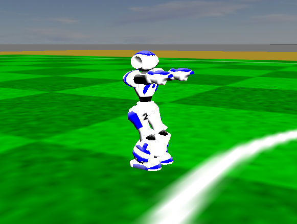

.. _make_the_robot_crouch:

Make the robot crouch
---------------------

First launch a player in the simulator by following instructions in :ref:`launching_a_player`.

In a new terminal, publish a single message on the `/motion/crouch` topic:

.. code-block:: console

  ros2 topic pub --once /motion/crouch std_msgs/msg/Empty

You should see the robot in the simulator is now crouching as shown below.

