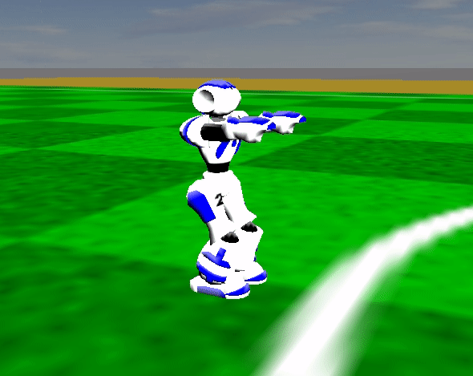

Make the robot kick
-------------------

First launch a player and have it crouch in the simulator by following instructions in :ref:`make_the_robot_crouch`.

In a new terminal, publish a single message on the `/motion/kick` topic:

.. code-block:: console

  ros2 topic pub --once /motion/kick motion_msgs/msg/Kick

You should see the robot in the simulator performing a kick as below:

.. tip::

  You can make the robot kick with its other foot by specifying it in the
  published message:

  .. code-block:: console

    ros2 topic pub --once /motion/kick motion_msgs/msg/Kick '{use_left_foot: True}'